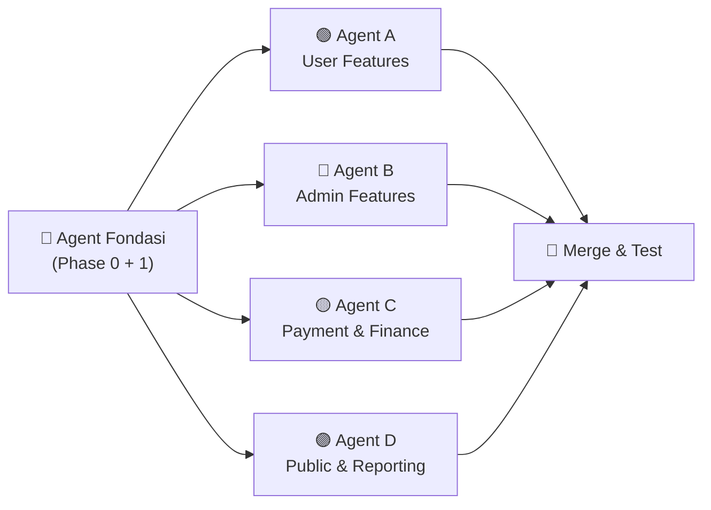

# 📋 Panduan Membuat Perintah untuk Setiap Agent

> Dokumen ini menjelaskan **bagaimana cara menulis perintah (prompt)** yang Anda berikan ke masing-masing agent AI saat mereka mulai mengerjakan bagian masing-masing.

---

## Prinsip Dasar Menulis Perintah Agent

### Struktur Prompt yang Efektif

Setiap perintah ke agent harus mengandung **5 elemen**:

```
1. KONTEKS     → "Kamu sedang mengerjakan proyek apa, posisimu di mana"
2. REFERENSI   → "Baca file ini sebagai panduan"
3. SCOPE       → "Kerjakan HANYA bagian ini, JANGAN sentuh bagian lain"
4. ATURAN      → "Ikuti konvensi ini"
5. OUTPUT      → "Hasil akhir yang diharapkan"
```

> [!IMPORTANT]
> Kunci utama agar agent tidak saling bentrok: **batasi scope dengan jelas** dan **sebutkan folder/file yang BOLEH disentuh**.

---

## Phase 0 — Fondasi (Dikerjakan Duluan, 1 Agent Saja)

Ini dikerjakan SEBELUM 4 agent mulai paralel.

### Prompt untuk Agent Fondasi

```
Kamu adalah developer Laravel. Kamu akan men-setup fondasi project karate tournament.

BACA file berikut sebagai panduan:
- @rancangan2.md (desain sistem lengkap)
- @implementation.md (panduan implementasi, Phase 0 dan Phase 1 saja)

KERJAKAN SECARA BERURUTAN:

1. STEP 0.1 — Inisialisasi Project Laravel
   - Buat project baru, install packages (livewire, dompdf)
   - Setup Tailwind CSS
   
2. STEP 0.2 — Buat SEMUA 10 migration
   - Ikuti urutan persis seperti di implementation.md
   - Pastikan semua FK, index, check constraint dibuat
   - Test dengan php artisan migrate:fresh
   
3. STEP 0.3 — Buat SEMUA 10 Eloquent Model
   - Lengkap dengan relasi, $fillable, $casts, Enum classes
   - Buat scope: Participant::athletes(), Participant::coaches()
   
4. STEP 1.1 — Setup Authentication
   - Install Laravel Breeze
   - Modifikasi register: buat User + Contingent dalam 1 transaction
   - Buat AdminMiddleware dan UserMiddleware
   - Buat seeder untuk admin account
   
5. STEP 1.2 — Routing & Layout
   - Buat route group /admin/* dan /dashboard/*
   - Buat layout Blade admin dan user (sidebar, navbar)
   - Pisahkan routes ke: routes/admin.php, routes/user.php, routes/public.php

6. Buat juga helper class ini (akan dipakai semua agent nanti):
   - app/Services/ActivityLogService.php
     Method: static log(?User $user, string $action, Model $subject, 
             ?string $description, ?array $properties)

JANGAN kerjakan fitur apapun selain yang di atas.
Setelah selesai, pastikan: php artisan migrate:fresh --seed berjalan tanpa error.
```

---

## Setelah Fondasi Selesai → 4 Agent Mulai Paralel

> [!NOTE]
> Setiap agent mendapat codebase yang sama (hasil fondasi) dan mulai bekerja. Mereka **tidak perlu menunggu satu sama lain** karena scope file mereka berbeda.

---

## Agent A — User-Side Features

### Prompt Awal Agent A (Step 1.3 + 2.1 + 2.2 + 2.3)

```
Kamu adalah developer Laravel yang mengerjakan fitur SISI USER (kontingen).
Project Laravel sudah di-setup dengan semua migration, model, auth, dan layout.

BACA file berikut sebagai panduan:
- @implementation.md → fokus ke Phase 1 Step 1.3, dan Phase 2 (Step 2.1 - 2.3)
- @rancangan2.md → untuk business rules detail

KERJAKAN HANYA fitur berikut, SECARA BERURUTAN:

1. STEP 1.3 — Profil Kontingen
   - Halaman view + edit profil kontingen
   - Ambil data via auth()->user()->contingent
   - Buat Form Request class untuk validasi

2. STEP 2.1 — CRUD Peserta (Atlet & Pelatih)
   - Halaman daftar peserta dengan filter: Semua | Atlet | Pelatih
   - Form tambah peserta (field berbeda untuk atlet vs pelatih)
   - Form edit, tombol hapus
   - Upload foto dan dokumen

3. STEP 2.2 — Upload & Preview File
   - Preview foto sebelum upload (JavaScript client-side)
   - Simpan ke storage/app/public/participants/photos/ dan .../documents/
   - Gunakan hash untuk nama file

4. STEP 2.3 — Proteksi Edit/Hapus (BR-14) ⚠️ KRITIKAL
   - Buat app/Services/ParticipantService.php
   - Method: canEditField($participant, $fieldName): bool
   - Method: canDelete($participant): bool
   - Lock Level 1: ada registrasi aktif → birth_date, gender, nik terkunci
   - Lock Level 2: is_verified = true → semua terkunci kecuali photo
   - Validasi di backend, bukan hanya disable di frontend

SCOPE FILE yang BOLEH kamu buat/edit:
- app/Http/Controllers/User/ContingentController.php
- app/Http/Controllers/User/ParticipantController.php
- app/Http/Requests/User/ (form requests)
- app/Services/ParticipantService.php
- resources/views/user/contingent/
- resources/views/user/participants/
- routes/user.php (tambahkan route, JANGAN hapus yang sudah ada)

JANGAN sentuh:
- File migration atau model (sudah selesai)
- Folder admin/ atau public/
- routes/admin.php atau routes/public.php
```

### Prompt Lanjutan Agent A (Step 4.1 - 4.5)

```
Lanjutkan pekerjaan sebelumnya. Sekarang kerjakan Engine Pendaftaran.

BACA: @implementation.md → Phase 4 (Step 4.1 - 4.5)

KERJAKAN:

1. STEP 4.1 — Halaman Pilih Event & Kategori
   - Tampilkan event yang status = 'registration_open'
   - Cek deadline (jika ada)
   - Navigasi bertahap: Event → Kategori → Sub-kategori
   - Gunakan Livewire component

2. STEP 4.2 — Filter Atlet Otomatis (BR-07) ⚠️
   - Buat scope: Participant::scopeEligibleFor($query, $subCategory)
   - Filter: type=athlete, contingent sendiri, gender cocok, umur dalam range
   - Filter: belum terdaftar di sub-kategori yang sama
   - FILTER DI DATABASE, bukan di PHP

3. STEP 4.3 — Validasi Beregu (BR-15)
   - Cek min_participants dan max_participants
   - Validasi di frontend DAN backend

4. STEP 4.4 — Pendaftaran Pelatih (BR-08)
   - Section terpisah untuk daftar pelatih
   - sub_category_id = NULL untuk pelatih (by design)
   - Cek duplikasi pelatih per event

5. STEP 4.5 — Kalkulasi Invoice (BR-16) ⚠️
   - Hitung: SUM(harga sub-kategori atlet) + (jumlah pelatih × coach_fee)
   - Tampilkan rincian invoice sebelum konfirmasi
   - Buat Payment + semua Registration dalam 1 DB::transaction()
   - total_amount di-SNAPSHOT (tidak berubah walau harga berubah)
   - Cek: belum ada payment aktif untuk kontingen+event ini

SCOPE FILE tambahan yang BOLEH dibuat:
- app/Http/Controllers/User/RegistrationController.php
- app/Services/RegistrationService.php
- app/Services/InvoiceService.php
- app/Http/Livewire/User/EventBrowser.php
- app/Http/Livewire/User/AthleteSelector.php
- resources/views/user/registration/
- resources/views/livewire/user/
```

---

## Agent B — Admin-Side Features

### Prompt Awal Agent B (Step 3.1 - 3.3)

```
Kamu adalah developer Laravel yang mengerjakan fitur SISI ADMIN.
Project Laravel sudah di-setup dengan semua migration, model, auth, dan layout.

BACA file berikut sebagai panduan:
- @implementation.md → Phase 3 (Step 3.1 - 3.3)
- @rancangan2.md → untuk business rules detail

KERJAKAN:

1. STEP 3.1 — CRUD Event
   - Halaman daftar event dengan status badge (draft, registration_open, dll)
   - Form buat/edit event
   - State machine untuk status transition:
     draft → registration_open → registration_closed → ongoing → completed
   - Buat app/Services/EventService.php
   - JANGAN izinkan edit event_date/coach_fee jika status ongoing/completed

2. STEP 3.2 — CRUD Event Categories (Kelas)
   - Di halaman detail event, tampilkan daftar kategori
   - Form CRUD: type, class_name, min_birth_date, max_birth_date
   - Jangan izinkan hapus jika ada registrasi aktif

3. STEP 3.3 — CRUD Sub-Categories
   - Di halaman detail kategori, tampilkan daftar sub-kategori
   - Form CRUD: name, gender, price, min_participants, max_participants
   - Jangan izinkan hapus jika ada registrasi aktif
   - Jangan izinkan edit harga jika sudah ada payment terbuat

SCOPE FILE yang BOLEH kamu buat/edit:
- app/Http/Controllers/Admin/EventController.php
- app/Http/Controllers/Admin/EventCategoryController.php
- app/Http/Controllers/Admin/SubCategoryController.php
- app/Http/Requests/Admin/ (form requests)
- app/Services/EventService.php
- resources/views/admin/events/
- routes/admin.php (tambahkan route, JANGAN hapus yang sudah ada)

JANGAN sentuh:
- File migration atau model (sudah selesai)
- Folder user/ atau public/
- routes/user.php atau routes/public.php
```

### Prompt Lanjutan Agent B (Step 5.3 - 5.6 + 6.5)

```
Lanjutkan pekerjaan. Sekarang kerjakan fitur Verifikasi dan Input Hasil.

BACA: @implementation.md → Phase 5 Step 5.3-5.6, dan Phase 6 Step 6.5

KERJAKAN:

1. STEP 5.3 — Verifikasi Payment (Approve/Reject)
   - Halaman daftar payment dengan filter status
   - Tampilkan bukti transfer (gambar)
   - Approve: dalam transaction → set verified, update registrations status_berkas
   - Reject: wajib isi alasan
   - Buat app/Services/PaymentVerificationService.php

2. STEP 5.4 — Revoke Payment (BR-11)
   - Tombol Revoke di payment yang sudah verified
   - Wajib isi alasan
   - Dalam transaction: status → pending, clear verified_at/by
   - Registrasi pending_review → unsubmitted
   - Registrasi yang sudah verified TIDAK berubah
   - Catat di activity_logs

3. STEP 5.5 — Verifikasi Berkas Peserta
   - Daftar registrasi dengan filter status_berkas
   - Tampilkan dokumen atlet
   - Verify: set status_berkas = verified + cek participants.is_verified
   - Reject: wajib alasan, atlet bisa upload ulang
   - Buat app/Services/DocumentVerificationService.php

4. STEP 5.6 — Revoke Verifikasi Peserta (BR-06)
   - Clear is_verified, verified_at, verified_by
   - Registrasi event sebelumnya TIDAK berubah
   - Catat di activity_logs

5. STEP 6.5 — Input Hasil Lomba
   - Admin pilih event → sub-kategori
   - Pilih pemenang: Gold (1), Silver (1), Bronze (1-2)
   - Simpan ke tabel results
   - Clear cache klasemen setelah simpan
   - Buat app/Services/ResultService.php

SCOPE FILE tambahan:
- app/Http/Controllers/Admin/PaymentVerificationController.php
- app/Http/Controllers/Admin/DocumentVerificationController.php
- app/Http/Controllers/Admin/ResultController.php
- app/Services/PaymentVerificationService.php
- app/Services/DocumentVerificationService.php
- app/Services/ResultService.php
- resources/views/admin/payments/
- resources/views/admin/verification/
- resources/views/admin/results/
```

---

## Agent C — Payment & Finance

### Prompt Agent C (Step 5.1 + 5.2 + 6.4)

```
Kamu adalah developer Laravel yang mengerjakan fitur PEMBAYARAN sisi user 
dan REKAP KEUANGAN sisi admin.
Project Laravel sudah di-setup dengan semua migration, model, auth, dan layout.

BACA file berikut sebagai panduan:
- @implementation.md → Phase 5 Step 5.1-5.2, dan Phase 6 Step 6.4
- @rancangan2.md → untuk business rules detail

KERJAKAN:

1. STEP 5.1 — Upload Bukti Transfer (User Side)
   - Di dashboard user, tampilkan daftar payment milik kontingennya
   - Untuk status pending/rejected: tampilkan form upload bukti transfer
   - Simpan ke storage/app/public/payments/proofs/
   - Jika rejected dan upload ulang: status → pending, clear rejection_reason
   - Tampilkan status warna: pending=kuning, verified=hijau, rejected=merah
   - Buat app/Services/PaymentService.php

2. STEP 5.2 — Pembatalan Payment oleh User (BR-10)
   - Tombol "Batalkan Pendaftaran" HANYA jika status pending/rejected
   - Konfirmasi dialog sebelum aksi
   - Dalam 1 DB::transaction():
     → payments.status = 'cancelled'
     → Soft-delete SEMUA registrations terkait
   - Catat di activity_logs
   - Setelah cancelled, kontingen bisa buat payment baru

3. STEP 6.4 — Rekap Keuangan (Admin Side)
   - Tabel: nama kontingen, total invoice, status payment
   - Total keseluruhan di bawah tabel
   - Filter by event dan status payment
   - Gunakan SUM() di database, jangan hitung di PHP
   - Buat app/Http/Controllers/Admin/FinanceController.php

SCOPE FILE yang BOLEH kamu buat/edit:
- app/Http/Controllers/User/PaymentController.php
- app/Http/Controllers/Admin/FinanceController.php
- app/Http/Requests/User/UploadProofRequest.php
- app/Services/PaymentService.php
- resources/views/user/payments/
- resources/views/admin/finance/
- routes/user.php (HANYA tambah route payment, jangan hapus yang ada)
- routes/admin.php (HANYA tambah route finance, jangan hapus yang ada)

JANGAN sentuh:
- File migration atau model
- Controller atau view milik agent lain
- routes/public.php
```

---

## Agent D — Public Pages & Reporting

### Prompt Agent D (Step 6.1 + 6.2 + 6.3)

```
Kamu adalah developer Laravel yang mengerjakan HALAMAN PUBLIK dan REPORTING.
Project Laravel sudah di-setup dengan semua migration, model, auth, dan layout.

BACA file berikut sebagai panduan:
- @implementation.md → Phase 6 Step 6.1-6.3
- @rancangan2.md → untuk query klasemen di §10 poin 8

KERJAKAN:

1. STEP 6.1 — Landing Page Publik
   - Halaman depan tanpa login
   - Tampilkan event dengan status: registration_open, registration_closed, 
     atau ongoing, DAN event_date >= today
   - JANGAN tampilkan event draft atau completed
   - Tampilkan: nama event, tanggal, status, jumlah kontingen terdaftar
   - Desain responsif dan menarik — ini "wajah" sistem

2. STEP 6.2 — Klasemen Real-Time dengan Cache
   - Buat Livewire component StandingsComponent dengan polling 60 detik
   - Query: JOIN contingents → participants → registrations → results
   - Filter by event_id, exclude soft-deleted registrations
   - Urutkan: Gold DESC → Silver DESC → Bronze DESC
   - Cache 60 detik: Cache::remember('standings_event_'.$eventId, 60, ...)
   - Tabel: Peringkat, Nama Kontingen, Emas, Perak, Perunggu, Total
   - Buat app/Services/StandingsService.php

3. STEP 6.3 — Entry List (PDF/Web)
   - Halaman web: daftar atlet per sub-kategori
   - Filter: event → kategori → sub-kategori
   - HANYA tampilkan registrasi yang payment verified dan NOT soft-deleted
   - Tombol "Download PDF" → generate via DomPDF
   - Layout PDF: A4, header (nama event, sub-kategori, tanggal)
   - Urutkan peserta alfabetis atau per kontingen
   - Buat app/Services/EntryListService.php

SCOPE FILE yang BOLEH kamu buat/edit:
- app/Http/Controllers/PublicController.php
- app/Http/Livewire/Public/StandingsComponent.php
- app/Services/StandingsService.php
- app/Services/EntryListService.php
- resources/views/public/
- resources/views/livewire/public/
- resources/views/pdf/entry-list.blade.php
- routes/public.php

JANGAN sentuh:
- File migration atau model
- Folder admin/ atau user/
- routes/admin.php atau routes/user.php
```

---

## Ringkasan: Pola Prompt

Setiap prompt agent mengikuti pola yang sama:

```
┌─────────────────────────────────────────────────┐
│  1. IDENTITAS                                   │
│     "Kamu adalah developer Laravel yang          │
│      mengerjakan fitur [SCOPE]"                  │
│                                                  │
│  2. STATUS PROJECT                              │
│     "Project sudah di-setup dengan semua         │
│      migration, model, auth, dan layout"         │
│                                                  │
│  3. REFERENSI                                   │
│     "BACA @implementation.md → Phase X Step Y"   │
│     "BACA @rancangan2.md → untuk business rules" │
│                                                  │
│  4. DAFTAR TUGAS                                │
│     "KERJAKAN secara berurutan:"                 │
│     - Step X.Y — [detail lengkap]                │
│     - Step X.Z — [detail lengkap]                │
│                                                  │
│  5. SCOPE FILE (WHITELIST)                      │
│     "BOLEH buat/edit: [daftar file]"             │
│                                                  │
│  6. LARANGAN (BLACKLIST)                        │
│     "JANGAN sentuh: [daftar file]"               │
└─────────────────────────────────────────────────┘
```

> [!TIP]
> **Tip Praktis:** Anda bisa copy-paste prompt di atas langsung ke chat AI baru. Yang perlu disesuaikan hanyalah referensi file `@rancangan2.md` dan `@implementation.md` — pastikan file tersebut di-attach atau direferensikan dengan benar di tool AI yang Anda gunakan.

---

## Urutan Eksekusi



| Tahap | Siapa | Durasi Estimasi |
|-------|-------|-----------------|
| 1. Fondasi | 1 agent / anda sendiri | 4-8 jam |
| 2. Paralel | 4 agent sekaligus | 8-16 jam (tergantung agent) |
| 3. Merge | 1 agent / anda | 2-4 jam (resolve conflict + test) |
| **Total** | | **~14-28 jam** vs ~40 jam jika serial |
