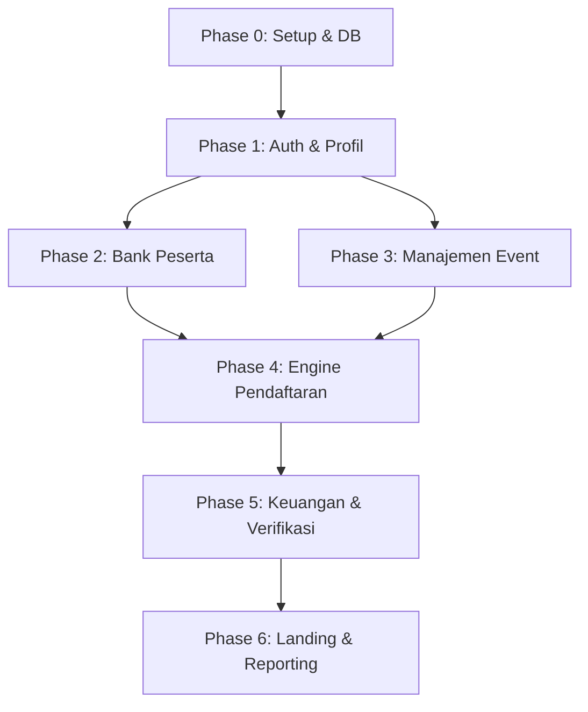
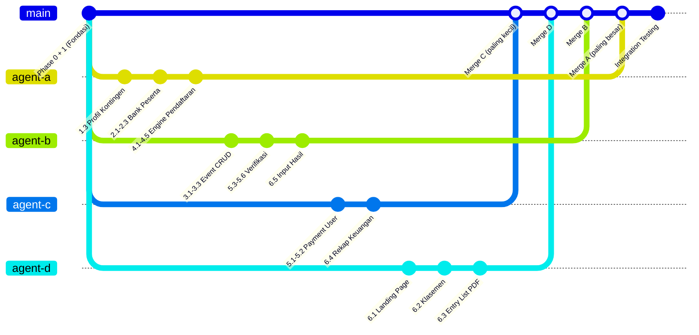

# 🚀 Rencana Kerja Paralel — 4 Agent Tracks

> Dokumen ini memecah [implementation.md](file:///d:/laragon/www/karatae-regis/implementation.md) menjadi **4 jalur kerja (agent track)** yang bisa dikerjakan **secara simultan** tanpa saling menunggu, kecuali di titik-titik sinkronisasi yang sudah ditentukan.

---

## 1. Analisis Dependency Graph

Dari `implementation.md`, dependency asli adalah:



### Titik-titik Paralel yang Teridentifikasi

| Observasi | Penjelasan |
|-----------|-----------|
| Phase 2 dan Phase 3 **TIDAK saling bergantung** | Bank Peserta (user) dan Manajemen Event (admin) bisa dikerjakan bersamaan |
| Phase 5 punya 2 sisi **independen**: user-side (upload bukti) dan admin-side (verifikasi) | Bisa di-split, asalkan model & service layer sudah ada |
| Phase 6 punya 4 sub-fitur yang **tidak saling bergantung** | Landing page, Klasemen, Entry List, Rekap Keuangan, Input Hasil — bisa dipecah |
| Semua Blade/Livewire view bisa dikerjakan **paralel** dengan backend logic | Asalkan contract (data shape) sudah disepakati |

---

## 2. Prasyarat Bersama (WAJIB Selesai Duluan)

> [!CAUTION]
> Pekerjaan berikut adalah **fondasi bersama** yang HARUS selesai sebelum 4 agent mulai bekerja paralel. Bisa dikerjakan oleh 1 agent atau secara kolaboratif.

### 🔧 Phase 0 + Phase 1 (Shared Foundation)

| Step | Apa yang dikerjakan | Estimasi |
|------|---------------------|----------|
| 0.1 | Inisialisasi project Laravel, install packages, setup Tailwind | 30 menit |
| 0.2 | **SEMUA 10 migration** (users → activity_logs) | 1-2 jam |
| 0.3 | **SEMUA 10 Eloquent Model** + relasi + scopes + Enum classes | 1-2 jam |
| 1.1 | Auth (Login/Register) + middleware admin/user | 1-2 jam |
| 1.2 | Routing & Layout (admin layout + user layout + sidebar + navbar) | 1-2 jam |

**Total: ~4-8 jam kerja**

> [!IMPORTANT]
> Setelah fondasi ini selesai, semua agent mendapat "snapshot" codebase yang sama dan mulai bekerja paralel di branch masing-masing.

---

## 3. Pembagian 4 Agent Track

```mermaid
gantt
    title Timeline Kerja 4 Agent (Setelah Fondasi Selesai)
    dateFormat  X
    axisFormat %s

    section Agent A: User Features
    1.3 Profil Kontingen           :a1, 0, 2
    2.1 CRUD Peserta (Atlet/Pelatih):a2, 2, 6
    2.2 Upload & Preview File      :a3, 6, 8
    2.3 Proteksi BR-14             :a4, 8, 11
    4.1 Pilih Event & Kategori     :a5, 11, 14
    4.2 Filter Atlet (BR-07)       :a6, 14, 18
    4.3 Validasi Beregu (BR-15)    :a7, 18, 20
    4.4 Pendaftaran Pelatih (BR-08):a8, 20, 22
    4.5 Kalkulasi Invoice (BR-16)  :a9, 22, 26

    section Agent B: Admin Features
    3.1 CRUD Event                 :b1, 0, 4
    3.2 CRUD Event Categories      :b2, 4, 7
    3.3 CRUD Sub-Categories        :b3, 7, 10
    5.3 Verifikasi Payment (Admin) :b4, 10, 14
    5.4 Revoke Payment (BR-11)     :b5, 14, 17
    5.5 Verifikasi Berkas Peserta  :b6, 17, 21
    5.6 Revoke Verifikasi (BR-06)  :b7, 21, 24
    6.5 Input Hasil Lomba          :b8, 24, 27

    section Agent C: Payment & Finance
    5.1 Upload Bukti Transfer      :c1, 0, 4
    5.2 Pembatalan Payment (BR-10) :c2, 4, 7
    6.4 Rekap Keuangan             :c3, 7, 10

    section Agent D: Public & Reporting
    6.1 Landing Page Publik        :d1, 0, 4
    6.2 Klasemen Real-Time + Cache :d2, 4, 8
    6.3 Entry List PDF             :d3, 8, 12
```



---

### 🟢 Agent A — User-Side Features (Kontingen & Pendaftaran)

**Cakupan:** Semua fitur yang digunakan oleh role `user` (kontingen)

| Prioritas | Step | Fitur | Dependency |
|-----------|------|-------|------------|
| 1 | 1.3 | Profil Kontingen (view + edit) | Fondasi saja |
| 2 | 2.1 | CRUD Peserta (Atlet & Pelatih) | Fondasi saja |
| 3 | 2.2 | Upload & Preview File | Step 2.1 |
| 4 | 2.3 | Proteksi Edit/Hapus (BR-14) ⚠️ | Step 2.1 |
| 5 | 4.1 | Halaman Pilih Event & Kategori | Fondasi + **Agent B harus sudah buat model Event/EventCategory/SubCategory** (tapi model sudah ada dari Phase 0!) |
| 6 | 4.2 | Filter Atlet Otomatis (BR-07) ⚠️ | Step 4.1 + Step 2.1 |
| 7 | 4.3 | Validasi Peserta Beregu (BR-15) | Step 4.2 |
| 8 | 4.4 | Pendaftaran Pelatih (BR-08) | Step 4.1 |
| 9 | 4.5 | Kalkulasi Invoice (BR-16) ⚠️ | Step 4.2 + 4.3 + 4.4 |

**File/folder utama yang disentuh:**
```
app/Http/Controllers/User/ContingentController.php
app/Http/Controllers/User/ParticipantController.php
app/Http/Controllers/User/RegistrationController.php
app/Services/ParticipantService.php
app/Services/RegistrationService.php
app/Services/InvoiceService.php
app/Http/Livewire/EventBrowser.php
app/Http/Livewire/AthleteSelector.php
resources/views/user/contingent/
resources/views/user/participants/
resources/views/user/registration/
```

> [!NOTE]
> Agent A **tidak perlu menunggu** Agent B untuk mulai kerja. Model Event, EventCategory, dan SubCategory sudah dibuat di Phase 0.3. Agent A bisa mulai mengerjakan Step 4.x menggunakan data seeder/factory.

---

### 🔵 Agent B — Admin-Side Features (Event & Verifikasi)

**Cakupan:** Semua fitur yang digunakan oleh role `admin`

| Prioritas | Step | Fitur | Dependency |
|-----------|------|-------|------------|
| 1 | 3.1 | CRUD Event + State Machine | Fondasi saja |
| 2 | 3.2 | CRUD Event Categories | Step 3.1 |
| 3 | 3.3 | CRUD Sub-Categories | Step 3.2 |
| 4 | 5.3 | Verifikasi Payment (Approve/Reject) | Fondasi + model Payment |
| 5 | 5.4 | Revoke Payment (BR-11) | Step 5.3 |
| 6 | 5.5 | Verifikasi Berkas Peserta | Fondasi + model Registration |
| 7 | 5.6 | Revoke Verifikasi Peserta (BR-06) | Step 5.5 |
| 8 | 6.5 | Input Hasil Lomba | Step 3.3 + model Registration |

**File/folder utama yang disentuh:**
```
app/Http/Controllers/Admin/EventController.php
app/Http/Controllers/Admin/EventCategoryController.php
app/Http/Controllers/Admin/SubCategoryController.php
app/Http/Controllers/Admin/PaymentVerificationController.php
app/Http/Controllers/Admin/DocumentVerificationController.php
app/Http/Controllers/Admin/ResultController.php
app/Services/EventService.php
app/Services/PaymentVerificationService.php
app/Services/DocumentVerificationService.php
app/Services/ResultService.php
resources/views/admin/events/
resources/views/admin/payments/
resources/views/admin/verification/
resources/views/admin/results/
```

> [!NOTE]
> Agent B bisa langsung mulai Step 3.1–3.3 tanpa menunggu siapapun. Untuk Step 5.3–5.6, Agent B bisa mengerjakan **service layer + controller** duluan menggunakan data factory/seeder, tanpa menunggu Agent A selesai membuat fitur registrasi.

---

### 🟡 Agent C — Payment & Finance (User Side)

**Cakupan:** Fitur pembayaran dari sisi user + rekap keuangan admin

| Prioritas | Step | Fitur | Dependency |
|-----------|------|-------|------------|
| 1 | 5.1 | Upload Bukti Transfer | Fondasi + model Payment |
| 2 | 5.2 | Pembatalan Payment (BR-10) | Step 5.1 |
| 3 | 6.4 | Rekap Keuangan (Admin) | Fondasi + model Payment |

**File/folder utama yang disentuh:**
```
app/Http/Controllers/User/PaymentController.php
app/Http/Controllers/Admin/FinanceController.php
app/Services/PaymentService.php
resources/views/user/payments/
resources/views/admin/finance/
```

> [!TIP]
> Agent C punya beban kerja lebih ringan. Setelah selesai 3 fitur utama, Agent C bisa **membantu Agent D** mengerjakan reporting, atau fokus pada **testing & quality assurance** untuk fitur payment.

---

### 🟣 Agent D — Public Pages & Reporting

**Cakupan:** Landing page publik, klasemen, entry list PDF

| Prioritas | Step | Fitur | Dependency |
|-----------|------|-------|------------|
| 1 | 6.1 | Landing Page Publik | Fondasi + model Event |
| 2 | 6.2 | Klasemen Real-Time + Cache | Fondasi + model Result |
| 3 | 6.3 | Entry List (PDF/Web) | Fondasi + model Registration |

**File/folder utama yang disentuh:**
```
app/Http/Controllers/PublicController.php
app/Http/Livewire/StandingsComponent.php
app/Services/StandingsService.php
app/Services/EntryListService.php
resources/views/public/landing.blade.php
resources/views/public/standings.blade.php
resources/views/public/entry-list.blade.php
resources/views/pdf/entry-list.blade.php
```

> [!TIP]
> Agent D juga punya beban kerja lebih ringan. Setelah selesai, bisa membantu **polish UI/UX**, **activity log integration**, atau **menulis seeder/factory data** untuk testing.

---

## 4. Contract & Interface Agreements

> [!IMPORTANT]
> Agar 4 agent bisa bekerja paralel tanpa konflik, mereka harus **sepakat pada interface/contract** berikut. Contract ini ditentukan di awal (sebelum agent mulai kerja).

### 4.1 — Service Layer Contracts

Setiap agent yang membuat Service class harus mengikuti signature yang disepakati:

```php
// Agent A membuat:
class ParticipantService {
    public function canEditField(Participant $p, string $field): bool;
    public function canDelete(Participant $p): bool;
    public function getEligibleAthletes(SubCategory $sub, Contingent $c): Collection;
}

class RegistrationService {
    public function registerAthletes(Payment $payment, SubCategory $sub, array $athleteIds): void;
    public function registerCoaches(Payment $payment, array $coachIds): void;
}

class InvoiceService {
    public function calculateTotal(array $registrationData, Event $event): float;
    public function createInvoice(Contingent $c, Event $e, array $data): Payment;
}

// Agent B membuat:
class EventService {
    public function canTransitionTo(Event $event, string $newStatus): bool;
    public function transitionStatus(Event $event, string $newStatus): void;
}

class PaymentVerificationService {
    public function approve(Payment $p, User $admin): void;
    public function reject(Payment $p, User $admin, string $reason): void;
    public function revoke(Payment $p, User $admin, string $reason): void;
}

class DocumentVerificationService {
    public function verifyDocument(Registration $reg, User $admin): void;
    public function rejectDocument(Registration $reg, User $admin, string $reason): void;
    public function revokeParticipantVerification(Participant $p, User $admin, string $reason): void;
}

class ResultService {
    public function saveResults(SubCategory $sub, array $results): void;
}

// Agent C membuat:
class PaymentService {
    public function uploadProof(Payment $p, UploadedFile $file): void;
    public function cancelPayment(Payment $p): void;
    public function getFinanceSummary(Event $event): array;
}

// Agent D membuat:
class StandingsService {
    public function getStandings(int $eventId): Collection;
}

class EntryListService {
    public function getEntryList(SubCategory $sub): Collection;
    public function generatePdf(SubCategory $sub): string; // returns file path
}
```

### 4.2 — ActivityLog Contract

Semua agent WAJIB menggunakan helper yang sama untuk logging:

```php
// Disepakati di awal, dibuat di Phase 0:
class ActivityLogService {
    public static function log(
        ?User $user,
        string $action,
        Model $subject,
        ?string $description = null,
        ?array $properties = null
    ): void;
}
```

### 4.3 — Routing Namespace Convention

| Agent | Route Prefix | Controller Namespace |
|-------|-------------|---------------------|
| A | `/dashboard/*` | `App\Http\Controllers\User\` |
| B | `/admin/*` | `App\Http\Controllers\Admin\` |
| C | `/dashboard/payments/*` (user) + `/admin/finance/*` (admin) | Shared namespace |
| D | `/` (public) | `App\Http\Controllers\PublicController` |

### 4.4 — View Directory Convention

```
resources/views/
├── layouts/
│   ├── admin.blade.php     ← Shared (dari Phase 1)
│   └── user.blade.php      ← Shared (dari Phase 1)
├── components/             ← Shared reusable components
├── user/                   ← Agent A + C
│   ├── contingent/
│   ├── participants/
│   ├── registration/
│   └── payments/           ← Agent C
├── admin/                  ← Agent B
│   ├── events/
│   ├── payments/
│   ├── verification/
│   ├── results/
│   └── finance/            ← Agent C
├── public/                 ← Agent D
│   ├── landing.blade.php
│   ├── standings.blade.php
│   └── entry-list.blade.php
└── pdf/                    ← Agent D
    └── entry-list.blade.php
```

---

## 5. Strategi Branching & Merge



**Urutan merge yang direkomendasikan:**
1. **Agent C** duluan (scope kecil, minim konflik)
2. **Agent D** (public pages, tidak ada konflik dengan admin/user)
3. **Agent B** (admin features)
4. **Agent A** (user features, scope terbesar, paling banyak cross-reference)

> [!WARNING]
> Setelah semua merge, **WAJIB lakukan integration testing** untuk memastikan:
> - Flow user: Register → Tambah Peserta → Pilih Event → Bayar → Upload Bukti
> - Flow admin: Buat Event → Verifikasi Payment → Verifikasi Berkas → Input Hasil
> - Cross-agent: Invoice calculation benar, klasemen ter-update setelah input hasil

---

## 6. Potensi Konflik & Mitigasi

| Konflik | Antara | Mitigasi |
|---------|--------|----------|
| Model `Payment` dipakai oleh 3 agent | A, B, C | Model sudah dibuat di Phase 0. Masing-masing agent hanya menambah **method di Service class**, bukan memodifikasi model |
| Model `Registration` dipakai oleh 3 agent | A, B, D | Sama — service class terpisah, model shared |
| Route conflict di `web.php` | Semua | Pisahkan route file: `routes/admin.php`, `routes/user.php`, `routes/public.php`. Load via `RouteServiceProvider` |
| Livewire component name clash | A, D | Gunakan namespace: `User\EventBrowser` vs `Public\StandingsComponent` |
| Migration conflict | Tidak ada | Semua migration dibuat di Phase 0, tidak ada agent yang buat migration baru |

---

## 7. Ringkasan Beban Kerja Per Agent

| Agent | Jumlah Step | Fitur Kritikal (⚠️) | Estimasi Relatif |
|-------|-------------|---------------------|-----------------|
| **A** — User Features | 9 steps | BR-14, BR-07, BR-16 | 🔴 **Berat** |
| **B** — Admin Features | 8 steps | BR-11, BR-06 | 🟡 **Sedang-Berat** |
| **C** — Payment & Finance | 3 steps | BR-10 | 🟢 **Ringan** |
| **D** — Public & Reporting | 3 steps | — | 🟢 **Ringan** |

> [!TIP]
> **Redistribusi opsional:** Jika menggunakan 3 agent saja, gabungkan Agent C + D menjadi satu agent "Payment, Public & Reporting" dengan total 6 steps — beban kerjanya menjadi setara dengan Agent B.

### Opsi 3 Agent (Alternatif)

| Agent | Cakupan | Steps |
|-------|---------|-------|
| **Alpha** — User Side | 1.3 + 2.x + 4.x + 5.1 + 5.2 | 11 steps |
| **Beta** — Admin Side | 3.x + 5.3-5.6 + 6.4 + 6.5 | 10 steps |
| **Gamma** — Public & PDF | 6.1 + 6.2 + 6.3 | 3 steps (tapi bisa bantu polish/testing) |

---

## 8. Checklist Per Agent

### Agent A Checklist
- [ ] Step 1.3 — Profil Kontingen
- [ ] Step 2.1 — CRUD Peserta
- [ ] Step 2.2 — Upload & Preview
- [ ] Step 2.3 — Proteksi BR-14
- [ ] Step 4.1 — Pilih Event & Kategori
- [ ] Step 4.2 — Filter Atlet (BR-07)
- [ ] Step 4.3 — Validasi Beregu (BR-15)
- [ ] Step 4.4 — Pendaftaran Pelatih (BR-08)
- [ ] Step 4.5 — Kalkulasi Invoice (BR-16)

### Agent B Checklist
- [ ] Step 3.1 — CRUD Event + State Machine
- [ ] Step 3.2 — CRUD Event Categories
- [ ] Step 3.3 — CRUD Sub-Categories
- [ ] Step 5.3 — Verifikasi Payment
- [ ] Step 5.4 — Revoke Payment (BR-11)
- [ ] Step 5.5 — Verifikasi Berkas Peserta
- [ ] Step 5.6 — Revoke Verifikasi (BR-06)
- [ ] Step 6.5 — Input Hasil Lomba

### Agent C Checklist
- [ ] Step 5.1 — Upload Bukti Transfer
- [ ] Step 5.2 — Pembatalan Payment (BR-10)
- [ ] Step 6.4 — Rekap Keuangan

### Agent D Checklist
- [ ] Step 6.1 — Landing Page Publik
- [ ] Step 6.2 — Klasemen Real-Time + Cache
- [ ] Step 6.3 — Entry List PDF
