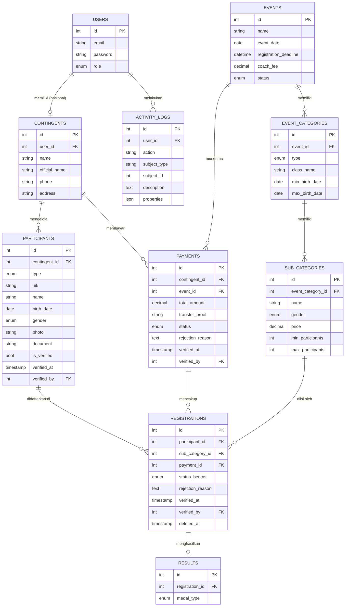

# Rancangan Sistem Manajemen Lomba Karate (v4)

---

## 1. Ringkasan Sistem (Executive Summary)

Sistem ini adalah platform manajemen pendaftaran lomba karate yang bersifat **Contingent-Based** (Berbasis Kontingen). Pendaftaran tidak dilakukan oleh individu, melainkan oleh manajer tim/dojo. Sistem menangani pendaftaran atlet dan pelatih, verifikasi pembayaran manual berbasis invoice per event, verifikasi berkas peserta dengan audit trail lengkap, hingga tampilan klasemen real-time di halaman depan.

---

## 2. Alur Kerja Utama (Flow)

### A. Alur Manager Kontingen (User)

1. **Pendaftaran Akun** — Membuat akun kontingen (1 akun = 1 kontingen).
2. **Manajemen Bank Peserta** — Menginput semua data atlet dan pelatih ke dalam tabel `participants` (Master Data), lengkap dengan foto (`photo`), berkas (`document` — Akta/Ijazah), tanggal lahir (`birth_date`), NIK (`nik`), dan gender (`gender`). Pelatih dan atlet dibedakan oleh kolom `type`.
3. **Proses Pendaftaran Lomba:**
   - Pilih Event → Pilih Jenis (Open/Festival) → Pilih Kategori (Junior/Senior/dll) → Pilih Sub-Kategori (Kumite -55kg, Kata Beregu, dll).
   - Sistem memfilter otomatis daftar atlet dari Bank Peserta yang memenuhi syarat berdasarkan **Gender** dan **Rentang Tanggal Lahir** yang sudah ditentukan di `event_categories`.
   - Pilih atlet yang akan diturunkan di sub-kategori tersebut.
   - Untuk mendaftarkan pelatih, pilih dari daftar pelatih di Bank Peserta (tidak terikat sub-kategori, hanya terikat ke event).
4. **Pembayaran:**
   - Sistem menghitung otomatis **total invoice** berdasarkan harga sub-kategori atlet + biaya pelatih (BR-16).
   - Kontingen mengunggah satu bukti transfer untuk invoice tersebut.
   - Menunggu verifikasi admin.
5. **Pembatalan:**
   - Kontingen dapat membatalkan payment selama status masih `pending` atau `rejected`.
   - Semua registrasi terkait di-soft-delete (data tetap ada untuk audit trail, tapi tidak muncul di query normal).
   - Setelah payment `verified`, pembatalan tidak bisa dilakukan oleh kontingen — hanya admin yang bisa me-revoke.
6. **Proteksi Data Peserta:**
   - Data kritis atlet (`birth_date`, `gender`, `nik`) **tidak boleh diedit** jika atlet memiliki registrasi aktif di event manapun (BR-14).
   - **Seluruh data** atlet terkunci jika admin sudah memverifikasi dokumennya (`is_verified = true`). Hanya `photo` yang masih bisa diperbarui (BR-14).
   - Atlet tidak boleh dihapus dari Bank Peserta jika memiliki registrasi aktif (BR-14).

### B. Alur Panitia (Admin)

1. **Setting Event** — Membuat event, lalu membuat kategori (Open/Festival) dan sub-kategori (Kumite -55kg Putra, Kata Individu Putri, dll) dengan menentukan rentang tanggal lahir (`min_birth_date` & `max_birth_date`) **per kelas**, gender, harga per peserta, serta batas minimum/maksimum peserta untuk kategori beregu (BR-15).
2. **Verifikasi Pembayaran** — Mengecek bukti transfer yang diunggah kontingen. Jika disetujui, **seluruh registrasi dalam invoice tersebut** berubah status menjadi `pending_review`. Jika ditolak, kontingen diwajibkan mengunggah ulang bukti transfer dengan alasan penolakan.
3. **Revoke Payment (Jika Perlu)** — Admin dapat me-revoke payment yang sudah `verified` jika ditemukan kesalahan (misal: bukti transfer palsu terdeteksi belakangan). Membutuhkan alasan wajib dan bersifat auditable.
4. **Verifikasi Berkas** — Mengecek dokumen atlet (Akta/Ijazah). Jika lolos, tandai atlet sebagai `is_verified = true` (Verified Permanen) agar event selanjutnya tidak perlu dicek lagi. Admin dapat me-revoke status ini jika diperlukan — hanya memengaruhi event **ke depan**, tidak mengubah status registrasi di event sebelumnya (BR-06).
5. **Input Hasil** — Menginput pemenang (Juara 1, 2, 3) per sub-kategori untuk memperbarui klasemen di landing page. Untuk sub-kategori yang memberikan dua medali Perunggu (keduanya semifinalis kalah), admin cukup menginput dua baris dengan `medal_type = 'Bronze'`.

---

## 3. Business Rules (Aturan Bisnis)

Bagian ini **wajib dibaca** oleh developer sebelum mulai coding untuk menghindari asumsi yang salah.

| # | Aturan | Detail |
|---|--------|--------|
| BR-01 | Satu atlet boleh mendaftar di **lebih dari satu sub-kategori** dalam event yang sama | Contoh: atlet yang sudah daftar Kata Beregu boleh juga daftar Kata Individu dan Kumite |
| BR-02 | Tidak ada batas jumlah atlet per kontingen | Kontingen boleh mendaftarkan berapapun atlet |
| BR-03 | Pembayaran bersifat **invoice penuh** | Satu kontingen menghasilkan satu `payment` per event. Invoice mencakup semua biaya atlet + pelatih. Dijaga oleh validasi di application layer (cek payment aktif non-cancelled untuk kontingen+event yang sama) |
| BR-04 | Jika payment di-**reject**, kontingen harus upload ulang | Status kembali ke `pending` setelah upload ulang, bukan membuat invoice baru |
| BR-05 | Jika payment di-**approve**, semua `registrations` yang terhubung ke payment tersebut berubah status menjadi `pending_review` sekaligus (bulk update) | Dikerjakan dalam satu database transaction |
| BR-06 | `is_verified` pada atlet bersifat **permanen tapi dapat di-revoke** | Admin dapat mencabut status verifikasi jika ditemukan dokumen palsu atau data tidak valid. **Efek revoke hanya berlaku untuk event ke depan** — registrasi yang sudah `verified` di event sebelumnya tidak berubah. Saat revoke: `is_verified`, `verified_at`, `verified_by` di-clear pada tabel `participants`, dan aksi dicatat di `activity_logs` |
| BR-07 | Filter otomatis atlet didasarkan pada **gender** dan **rentang tanggal lahir** yang ada di `event_categories` | Rentang usia ditentukan per kelas (misal: Junior, Senior). Atlet yang tidak masuk rentang tidak akan muncul di daftar pilihan |
| BR-08 | Pelatih **tidak terikat sub-kategori**, hanya terikat ke event | `sub_category_id` di tabel `registrations` bernilai `NULL` untuk pelatih |
| BR-09 | Satu atlet **tidak boleh didaftarkan dua kali** di sub-kategori yang sama dalam satu event | Dijaga oleh validasi di application layer (cek registrasi aktif non-soft-deleted untuk participant+sub_category yang sama) |
| BR-10 | Kontingen dapat **membatalkan payment** selama status masih `pending` atau `rejected` | Semua registrasi terkait di-**soft-delete** (data tetap ada di database untuk audit trail). Setelah `verified`, hanya admin yang bisa revoke |
| BR-11 | Admin dapat **me-revoke payment** yang sudah `verified` | Membutuhkan alasan wajib (`rejection_reason`). Semua registrasi terkait yang `pending_review` dikembalikan ke `unsubmitted` |
| BR-12 | **Dua medali Perunggu** dapat diberikan dalam satu sub-kategori | Admin cukup menginput dua baris di tabel `results` dengan `medal_type = 'Bronze'`. Klasemen menghitung total Bronze dari semua baris |
| BR-13 | **Registration deadline** di-enforce di application layer | Sistem menolak pendaftaran baru jika `NOW() > registration_deadline`. Jika `registration_deadline = NULL`, pendaftaran terbuka selama `events.status = 'registration_open'`. Admin tetap bisa mendaftarkan atlet secara manual setelah deadline (override) |
| BR-14 | **Proteksi edit & hapus** data peserta yang sudah terdaftar | **Lock Level 1 (Registrasi Aktif):** Jika atlet memiliki registrasi aktif (non-cancelled) di event manapun, field kritis (`birth_date`, `gender`, `nik`) tidak boleh diedit. Field non-kritis (`name`, `photo`, `document`) masih boleh diedit. **Lock Level 2 (Verified):** Jika `is_verified = true`, semua field terkunci kecuali `photo`. **Hapus:** Atlet/pelatih tidak boleh dihapus jika memiliki registrasi aktif (non-cancelled). Implementasi: validasi di service layer |
| BR-15 | Sub-kategori beregu memiliki batas **min/max peserta** | Ditentukan via kolom `min_participants` dan `max_participants` di `sub_categories`. Default `1` untuk kategori individu. Validasi di application layer saat pendaftaran. Nilai ini dikonfigurasi admin saat membuat sub-kategori |
| BR-16 | `total_amount` pada payment **dihitung otomatis oleh sistem** | Formula: `SUM(sub_categories.price untuk semua registrasi atlet) + (jumlah_pelatih × events.coach_fee)`. Nilai di-**snapshot** saat invoice dibuat. Perubahan harga sub-kategori setelah invoice dibuat **tidak mengubah** `total_amount` yang sudah ada. Field ini tidak boleh diedit manual |

---

## 4. Skema Database

> **Catatan untuk developer:** Laravel otomatis membuat kolom `created_at` dan `updated_at` melalui `$table->timestamps()` di migration. Kolom ini **wajib ada di semua tabel** — jangan dilewati. Kolom `verified_at` dan `verified_by` di beberapa tabel adalah tambahan eksplisit untuk audit trail keuangan dan verifikasi berkas.

> **Konvensi penamaan:** Seluruh kolom menggunakan **bahasa Inggris** untuk konsistensi, kompatibilitas dengan tools/AI, dan kemudahan maintenance jangka panjang.

### 4.1 Tabel Inti

```sql
users
  id, email, password, role ENUM('admin','user')
  -- timestamps() — created_at, updated_at (otomatis dari Laravel)

contingents
  id
  user_id         FK → users    NOT NULL
  name            VARCHAR                  -- Nama kontingen (umum)
  official_name   VARCHAR                  -- Nama resmi kontingen
  phone           VARCHAR(20)   NULL
  address         TEXT          NULL
  -- timestamps()

  -- CATATAN: Relasi ini ONE-TO-ZERO-OR-ONE dari sisi users.
  -- Admin TIDAK memiliki baris di tabel contingents. Setiap contingent
  -- WAJIB memiliki user (user_id NOT NULL). ERD: USERS ||--o| CONTINGENTS.

participants                          -- Gabungan atlet & pelatih
  id
  contingent_id   FK → contingents
  type            ENUM('athlete','coach')
  nik             VARCHAR(16)   NULL  -- Wajib untuk atlet, NULL untuk pelatih
  name            VARCHAR
  birth_date      DATE          NULL  -- NULL untuk pelatih
  gender          ENUM('M','F') NULL  -- NULL untuk pelatih
  photo           VARCHAR
  document        VARCHAR       NULL  -- Akta/Ijazah. NULL untuk pelatih
  is_verified     BOOLEAN DEFAULT FALSE
  verified_at     TIMESTAMP     NULL  -- Diisi saat is_verified = true
  verified_by     INT           NULL  FK → users  -- Admin yang memverifikasi
  -- timestamps()

  CONSTRAINT chk_athlete_data CHECK (
    type = 'coach'
    OR (birth_date IS NOT NULL AND gender IS NOT NULL AND nik IS NOT NULL)
  )
  UNIQUE KEY unique_nik (nik)
```

> **Catatan untuk developer:**
> - Gunakan satu tabel `participants` untuk semua peserta. Bedakan atlet dan pelatih hanya melalui kolom `type`.
> - `CHECK CONSTRAINT` memastikan atlet tidak bisa disimpan tanpa `birth_date`, `gender`, dan `nik`. Ini mencegah data rusak yang akan merusak filter di Modul 4.
> - NIK harus divalidasi di application layer sebagai string 16 digit angka. Gunakan Laravel validation rule `digits:16`.
> - `UNIQUE KEY unique_nik` hanya efektif untuk nilai non-NULL. Dua pelatih dengan NIK NULL tidak akan konflik — ini by design.
> - `verified_at` dan `verified_by` mencatat **state terakhir** verifikasi. Riwayat lengkap (siapa verify, siapa revoke, kapan, alasan) dicatat di tabel `activity_logs` (§4.6).

### 4.2 Tabel Event & Kategori

```sql
events
  id
  name                  VARCHAR              -- Nama event
  event_date            DATE                 -- Tanggal lomba
  registration_deadline DATETIME  NULL       -- NULL = tidak ada deadline otomatis (lihat BR-13)
  coach_fee             DECIMAL              -- Biaya per pelatih per event
  status                ENUM('draft','registration_open','registration_closed','ongoing','completed')
                        DEFAULT 'draft'
  -- timestamps()

event_categories
  id
  event_id        FK → events
  type            ENUM('Open','Festival')
  class_name      VARCHAR         -- contoh: 'Junior', 'Senior', 'Cadet'
  min_birth_date  DATE            -- Batas rentang usia berlaku per KELAS
  max_birth_date  DATE            -- Contoh: Junior = 2008-01-01 s.d. 2013-12-31
  -- timestamps()

  -- DESAIN: min_birth_date dan max_birth_date SENGAJA di level event_categories
  -- karena rentang usia ditentukan per kelas (Junior, Senior, dll).
  -- Semua sub-kategori dalam kelas yang sama (Kata, Kumite, dll) berbagi
  -- rentang usia yang sama. Gender ditentukan di level sub_categories.

sub_categories
  id
  event_category_id   FK → event_categories
  name                VARCHAR   -- contoh: 'Kumite -55kg', 'Kata Individu', 'Kata Beregu'
  gender              ENUM('M','F','Mixed')
  price               DECIMAL
  min_participants    INT DEFAULT 1   -- 1 untuk individu, 3 untuk beregu (minimum)
  max_participants    INT DEFAULT 1   -- 1 untuk individu, 5 untuk beregu (termasuk cadangan)
  -- timestamps()
```

> **Catatan untuk developer:**
> - `min_participants` dan `max_participants` digunakan untuk validasi jumlah atlet pada kategori beregu (BR-15).
> - Untuk kategori individu, biarkan default `1` dan `1`. Untuk beregu, admin mengisi saat membuat sub-kategori.
> - Validasi dilakukan di application layer: `count(atlet terdaftar) >= min_participants` dan `<= max_participants`.

### 4.3 Tabel Transaksi & Hasil

```sql
payments
  id
  contingent_id     FK → contingents
  event_id          FK → events
  total_amount      DECIMAL              -- Dihitung otomatis oleh sistem (BR-16)
  transfer_proof    VARCHAR       NULL   -- Path file bukti transfer
  status            ENUM('pending','verified','rejected','cancelled')
                    DEFAULT 'pending'
  rejection_reason  TEXT          NULL   -- Wajib diisi saat reject atau revoke
  verified_at       TIMESTAMP     NULL   -- Diisi saat status = verified
  verified_by       INT           NULL   FK → users  -- Admin yang melakukan aksi
  -- timestamps()

  -- CATATAN: UNIQUE(contingent_id, event_id) TIDAK diterapkan di level database
  -- karena payment yang sudah cancelled harus mengizinkan kontingen membuat
  -- payment baru untuk event yang sama. Validasi di application layer:
  -- cek apakah sudah ada payment non-cancelled untuk contingent+event tersebut.

registrations
  id
  participant_id    FK → participants
  payment_id        FK → payments
  sub_category_id   FK → sub_categories   NULL  -- NULL jika pelatih (BR-08)
  status_berkas     ENUM('unsubmitted','pending_review','verified','rejected')
                    DEFAULT 'unsubmitted'
  rejection_reason  TEXT          NULL   -- Diisi saat status_berkas = rejected
  verified_at       TIMESTAMP     NULL   -- Diisi saat status_berkas = verified
  verified_by       INT           NULL   FK → users
  deleted_at        TIMESTAMP     NULL   -- Soft delete (Laravel SoftDeletes)
  -- timestamps()

  -- CATATAN: UNIQUE(participant_id, sub_category_id) TIDAK diterapkan di level
  -- database karena soft-deleted records akan konflik dengan registrasi baru
  -- di MySQL. Validasi di application layer: sebelum insert, cek apakah sudah
  -- ada registrasi aktif (non-soft-deleted) untuk participant+sub_category
  -- yang sama. Pencegahan duplikasi pelatih per event juga di application layer.

results
  id
  registration_id   FK → registrations
  medal_type        ENUM('Gold','Silver','Bronze')
  -- timestamps()

  -- CATATAN BR-12: Dua medali Bronze per sub-kategori adalah VALID.
  -- Cukup insert dua baris dengan medal_type = 'Bronze' untuk dua registration
  -- berbeda dalam sub-kategori yang sama. Tidak perlu perubahan struktur.
  -- Kalkulasi klasemen menggunakan COUNT(*) per medal_type — 1 atau 2 Bronze
  -- keduanya terhitung dengan benar secara otomatis.
```

> **Catatan untuk developer:**
> - Gunakan `$table->softDeletes()` di migration tabel `registrations`. Semua query Eloquent otomatis mengabaikan baris yang soft-deleted.
> - `total_amount` dihitung sistem saat invoice dibuat: `SUM(sub_categories.price) + (jumlah_pelatih × events.coach_fee)`. Lihat BR-16.
> - Constraint uniqueness yang sebelumnya di level DB dipindah ke application layer karena soft delete tidak kompatibel dengan MySQL UNIQUE constraint. Pastikan validasi ini ada di service layer sebelum insert.

### 4.4 State Machine

#### `payments.status`

```
                        Admin approve
  [pending] ────────────────────────────────► [verified]
      ▲                                            │
      │  Kontingen upload ulang                    │ Admin revoke (BR-11)
      │                                            │ (rejection_reason wajib)
  [rejected] ◄──── Admin reject ──────────── [pending*]

  [pending]  ──── Kontingen batalkan ──► [cancelled]
  [rejected] ──── Kontingen batalkan ──► [cancelled]
```

| Transisi | Trigger | Efek Samping (dalam DB Transaction) |
|----------|---------|--------------------------------------|
| `pending` → `verified` | Admin klik "Approve" | Semua `registrations.status_berkas` yang masih `unsubmitted` → `pending_review`. Set `verified_at` dan `verified_by` |
| `pending` → `rejected` | Admin klik "Reject" | `rejection_reason` diisi wajib. `transfer_proof` tidak dihapus (untuk referensi) |
| `rejected` → `pending` | Kontingen upload bukti baru | `transfer_proof` di-update. `rejection_reason` di-clear |
| `verified` → `pending` | Admin klik "Revoke Approval" | `rejection_reason` diisi wajib. Semua `registrations.status_berkas` yang `pending_review` → `unsubmitted`. `verified_at` dan `verified_by` di-clear. Dicatat di `activity_logs` |
| `pending` → `cancelled` | Kontingen klik "Batalkan" | Semua `registrations` terkait di-**soft-delete** (`deleted_at` diisi). Dicatat di `activity_logs` |
| `rejected` → `cancelled` | Kontingen klik "Batalkan" | Sama seperti di atas |

> **Catatan:** Status `verified` TIDAK bisa langsung pindah ke `cancelled`. Jika admin menemukan masalah setelah approval, alurnya: **revoke → pending → rejected → (kontingen batalkan) → cancelled**.

#### `registrations.status_berkas`

```
[unsubmitted] ──► [pending_review] ──► [verified]
                         │
                         └──► [rejected] ──► [pending_review]
                                  (upload ulang berkas)
```

| Status | Arti |
|--------|------|
| `unsubmitted` | Atlet belum pernah mengumpulkan berkas |
| `pending_review` | Berkas sudah ada, menunggu cek admin. Otomatis diset saat payment di-approve |
| `verified` | Berkas lolos. Set `verified_at` dan `verified_by` di `registrations`. Jika ini verifikasi pertama atlet, set juga `is_verified`, `verified_at`, `verified_by` di `participants` |
| `rejected` | Berkas ditolak, `rejection_reason` diisi, atlet diminta upload ulang |

> **Catatan:** Pelatih (`type = 'coach'`) tidak memerlukan verifikasi berkas. Set `status_berkas = 'verified'` otomatis saat registrasi pelatih dibuat.

### 4.5 Index Database

> **Apa itu Index?**
> Bayangkan tabel database seperti buku tanpa daftar isi. Untuk menemukan kata "Kumite", kamu harus membaca setiap halaman dari awal. Index seperti daftar isi: langsung loncat ke halaman yang relevan.
>
> Tanpa index pada kolom yang sering di-filter atau di-JOIN (seperti `contingent_id`), semakin banyak data, semakin lambat query karena database harus scan seluruh tabel (*full table scan*). Dengan index, kecepatan query hampir konstan meskipun data bertambah jutaan baris.
>
> **Kapan index otomatis dibuat?** Primary Key (`id`) dan Foreign Key (`*_id`) sudah di-index otomatis oleh MySQL/Laravel. Index berikut adalah **tambahan** untuk query yang lebih spesifik.

```sql
-- Di tabel participants:
INDEX idx_participants_type_gender_dob (type, gender, birth_date)
-- Untuk: filter atlet by gender + rentang usia di Modul 4 (query paling sering dijalankan)

-- Di tabel registrations:
INDEX idx_registrations_status_berkas (status_berkas)
-- Untuk: admin filter registrasi berdasarkan status verifikasi berkas

-- Di tabel payments:
INDEX idx_payments_status (status)
-- Untuk: admin filter payment yang perlu diverifikasi (WHERE status = 'pending')

-- Di tabel results:
INDEX idx_results_medal (medal_type)
-- Untuk: kalkulasi klasemen (GROUP BY medal_type)

-- Di tabel activity_logs:
INDEX idx_activity_subject (subject_type, subject_id)
-- Untuk: melihat riwayat aksi pada entitas tertentu
```

> **Catatan:** Buat index di migration menggunakan `$table->index(['kolom1', 'kolom2'])`. Laravel otomatis membuat index pada kolom `deleted_at` saat menggunakan `$table->softDeletes()`.

### 4.6 Tabel Audit

```sql
activity_logs
  id
  user_id           FK → users     NULL  -- NULL untuk aksi otomatis oleh sistem
  action            VARCHAR              -- Contoh: 'payment.approved', 'payment.revoked',
                                         -- 'participant.verified', 'participant.verification_revoked',
                                         -- 'registration.cancelled', 'participant.updated'
  subject_type      VARCHAR              -- Nama model: 'Payment', 'Participant', 'Registration'
  subject_id        INT                  -- ID dari entitas yang terkena aksi
  description       TEXT          NULL    -- Deskripsi ringkas (opsional)
  properties        JSON          NULL    -- Data before/after: {"old": {...}, "new": {...}}
  -- timestamps()

  INDEX idx_activity_subject (subject_type, subject_id)
  INDEX idx_activity_user (user_id)
```

> **Catatan untuk developer:**
> - Tabel ini mencatat **semua aksi penting** yang bersifat auditable: approve/reject/revoke payment, verify/revoke berkas peserta, edit data peserta, pembatalan, dll.
> - Kolom `properties` menyimpan snapshot data sebelum dan sesudah aksi dalam format JSON. Contoh:
>   ```json
>   {
>     "old": {"is_verified": true, "verified_by": 1},
>     "new": {"is_verified": false, "verified_by": null},
>     "reason": "Dokumen akta terdeteksi palsu"
>   }
>   ```
> - Dapat menggunakan package `spatie/laravel-activitylog` yang skema-nya kompatibel, atau implementasi manual sederhana.
> - **Aksi yang WAJIB dicatat:** payment approval/rejection/revoke/cancellation, participant verification/revoke, edit data peserta yang sudah verified.

---

## 5. ERD (Entity Relationship Diagram)



---

## 6. Identifikasi Modul

| Modul | Nama | Tanggung Jawab |
|-------|------|----------------|
| M1 | Auth & Profil | Login, register, relasi user → kontingen |
| M2 | Bank Peserta | CRUD `participants` (atlet & pelatih), upload foto/berkas, validasi NIK, proteksi edit/hapus (BR-14) |
| M3 | Manajemen Event | Panel admin: events, event_categories, sub_categories (termasuk min/max peserta) |
| M4 | Engine Pendaftaran | Filter atlet by umur+gender, validasi min/max peserta beregu, kalkulasi invoice otomatis, simpan ke `registrations` |
| M5 | Keuangan & Verifikasi | Upload bukti bayar, approval/reject/revoke payment, verifikasi berkas, pembatalan (soft delete), audit trail via `activity_logs` |
| M6 | Landing Page & Reporting | Klasemen publik, cetak Entry List, rekap keuangan |

---

## 7. Strategi Landing Page & Klasemen (Modul 6)

### Rekomendasi: Laravel File Cache

Tidak diperlukan Redis. Gunakan **Laravel built-in file cache** dengan TTL 60 detik.

**Alasan pemilihan:**
- Zero konfigurasi tambahan (sudah built-in Laravel).
- Beban server minimal — query berat klasemen hanya dieksekusi sekali per menit, bukan setiap request.
- Cukup untuk skala lomba daerah/nasional (bukan platform streaming jutaan user).

**Contoh implementasi di controller:**
```php
$standings = Cache::remember('standings_event_' . $eventId, 60, function () use ($eventId) {
    return Contingent::withMedalCount($eventId)->orderByMedals()->get();
});
```

**Livewire polling interval: 60 detik**

```php
// Di Livewire component
#[Polling(interval: '60s')]
class StandingsComponent extends Component { ... }
```

> Interval 60 detik adalah keseimbangan antara "terasa real-time" dan "tidak membunuh server". Untuk final event penting, admin dapat clear cache manual via panel admin jika butuh update instan.

**Aturan tampilan event:**
- Hanya tampilkan event dengan `status IN ('registration_open', 'registration_closed', 'ongoing')` dan `event_date >= TODAY`.
- Event dengan status `draft` atau `completed` **tidak ditampilkan** di landing page.
- Hasil/klasemen event lama tetap bisa diakses via halaman arsip terpisah (opsional).

---

## 8. Strategi Laporan (Reporting)

Tiga jenis laporan wajib tersedia:

| Laporan | Format | Isi |
|---------|--------|-----|
| Entry List | PDF / Tabel Web | Daftar nama peserta per sub-kategori. Contoh: semua atlet Kumite -55kg Putra |
| Rekap Keuangan | Tabel Web | Total biaya per kontingen + total keseluruhan event |
| Klasemen | Landing Page (Live) | Urutan kontingen: Emas → Perak → Perunggu |

---

## 9. Stack Teknologi

| Layer | Teknologi | Alasan |
|-------|-----------|--------|
| Framework | Laravel (PHP) | Mature, ekosistem lengkap, mudah dipelajari junior |
| Frontend Reaktif | Livewire | Filter atlet instan + polling klasemen tanpa full-page refresh |
| Database | MySQL | Standar industri, mudah di-hosting |
| File Storage | Local Storage (dev) / S3 (prod) | Ribuan foto atlet membutuhkan object storage yang skalabel |
| UI | Tailwind CSS | Utility-first, mudah dikustomisasi oleh junior |
| Cache | Laravel File Cache | Built-in, zero setup, cukup untuk skala ini |
| Audit Trail | `activity_logs` tabel (+ opsional `spatie/laravel-activitylog`) | Mencatat semua aksi penting untuk accountability |

---

## 10. Catatan untuk Junior Developer

1. **Mulai dari M1 (Auth) → M2 (Bank Peserta) → M3 (Event) → M4 (Registrasi) → M5 (Keuangan) → M6 (Landing Page).** Urutan ini penting karena setiap modul bergantung pada modul sebelumnya.
2. **Selalu filter participants dengan `WHERE type = 'athlete'`** saat menampilkan daftar atlet untuk pendaftaran sub-kategori.
3. **Jangan lupa handle `sub_category_id = NULL`** untuk registrasi pelatih — ini valid dan by design (BR-08).
4. **Gunakan Eloquent Scopes** untuk filter umur dan gender agar kode bersih dan bisa di-reuse.
5. **Payment approval, reject, revoke, dan cancellation HARUS menggunakan Database Transaction** untuk memastikan update status `payment` dan semua `registrations` terkait bersifat atomik (all-or-nothing). Gunakan `DB::transaction(function () { ... })`.
6. **Validasi NIK di application layer** sebelum simpan: harus string 16 digit angka. Gunakan Laravel validation rule `digits:16`.
7. **Index `idx_participants_type_gender_dob`** adalah yang paling kritis untuk Modul 4. Pastikan index ini dibuat di migration sebelum load testing.
8. **Untuk kalkulasi klasemen**, query berikut adalah acuan:
   ```php
   Contingent::select('contingents.*')
       ->selectRaw('SUM(CASE WHEN results.medal_type = "Gold" THEN 1 ELSE 0 END) as gold_count')
       ->selectRaw('SUM(CASE WHEN results.medal_type = "Silver" THEN 1 ELSE 0 END) as silver_count')
       ->selectRaw('SUM(CASE WHEN results.medal_type = "Bronze" THEN 1 ELSE 0 END) as bronze_count')
       ->join('participants', 'participants.contingent_id', '=', 'contingents.id')
       ->join('registrations', 'registrations.participant_id', '=', 'participants.id')
       ->join('results', 'results.registration_id', '=', 'registrations.id')
       ->join('payments', 'payments.id', '=', 'registrations.payment_id')
       ->where('payments.event_id', $eventId)
       ->whereNull('registrations.deleted_at')
       ->groupBy('contingents.id')
       ->orderByDesc('gold_count')
       ->orderByDesc('silver_count')
       ->orderByDesc('bronze_count')
       ->get();
   ```
9. **Pencegahan duplikasi pelatih per event** tidak bisa dijaga oleh database constraint karena `sub_category_id` adalah NULL. Tambahkan validasi di service layer: sebelum insert registrasi pelatih, cek apakah pelatih tersebut sudah terdaftar di event yang sama melalui payment yang aktif (bukan cancelled) dan registrasi yang belum soft-deleted.
10. **Pencegahan duplikasi atlet per sub-kategori** juga dijaga di application layer (bukan DB constraint) karena soft delete. Sebelum insert, cek: `Registration::where('participant_id', $id)->where('sub_category_id', $subCatId)->exists()`.
11. **Pencegahan duplikasi payment per kontingen per event** dijaga di application layer. Sebelum buat payment baru, cek: `Payment::where('contingent_id', $id)->where('event_id', $eventId)->whereNot('status', 'cancelled')->exists()`.
12. **Proteksi edit/hapus peserta (BR-14)** harus di-implementasikan di service layer M2. Sebelum update/delete participant, cek apakah ada registrasi aktif dan status `is_verified`.
13. **Catat semua aksi penting ke `activity_logs`** — terutama: payment approval/rejection/revoke, verifikasi/revoke berkas, pembatalan payment, dan edit data peserta. Gunakan helper/service yang konsisten agar tidak ada yang terlewat.
14. **Saat me-revoke `is_verified` pada participant:** clear `is_verified`, `verified_at`, `verified_by` pada tabel `participants`. Registrasi yang sudah `verified` di event sebelumnya **tidak berubah** (BR-06). Catat aksi di `activity_logs` dengan alasan revoke.
15. **Untuk validasi jumlah peserta beregu (BR-15):** cek `count(registrasi aktif di sub-kategori) >= min_participants AND <= max_participants` sebelum menyimpan registrasi. Tampilkan pesan error yang jelas jika tidak memenuhi syarat.
